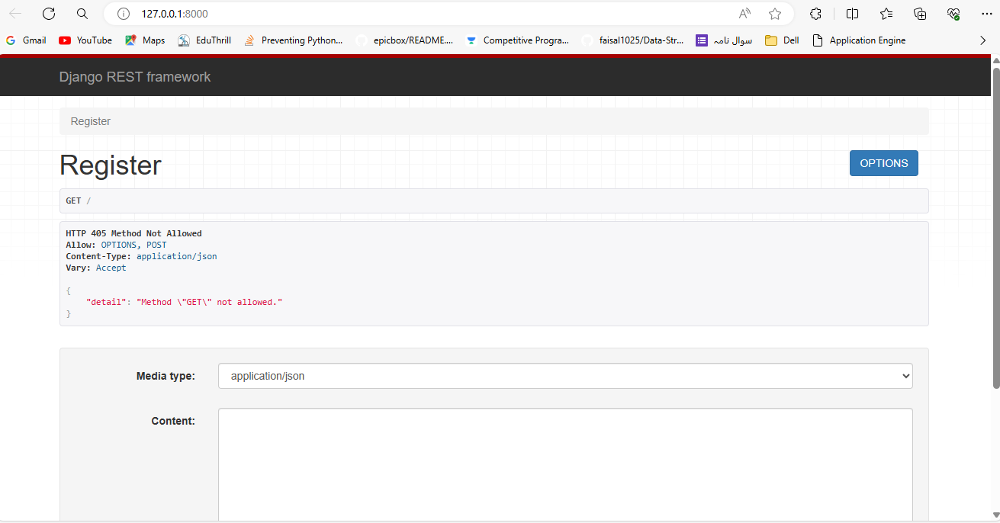

# Assignment Project

Hello, This is the API part of the assignment project where I have a created a this API server using Django Rest Framework, I have implemented JWT Token Authentication and Monogdb for storing user information as a database as written in the assignment.

Different API routes I have created is as follows :
- "" (blank or home route) | POST | AllowAny - This route I have create to handle register request creates new user.
- "login/" | POST | AllowAny - This route is attached to view which handles login of existing user. 
- "dashboard/" | GET | OnlyAuthenticated - This route will fetch the user data and sends back to client to show.
- "edit/" | POST | OnlyAuthenticated - This route view will update the user data only for autheticated user.
- "analyze/" | POST | OnlyAuthenticated - This route analyze the text using hugging face ML package transformers and send back the analyzed result.

## Authentication and Authorization

For Authentication I have used JWT Authentication with the help of a python pakage djangorestframework-simplejwt. For this I have done the required settings in the settings.py the time duration of token expires is 1 hour. I am generating the token Manually using RefreshToken.for_user(user) in the register and login routes. And after generating sending back to the client where I am storing the tokens in the localStorage of the browser.

For Authorization I have used the in-bild Permissions of django rest framework IsAuthenticated permission using permission_classes() decorator because I am using functional API. There are so many permissions IsAuthenticated, AllowAny, IsAdmin, I have used IsAuthenticated here in 'dashboard/', 'edit/', and 'analyzer/' routes.

## Text Analyzer (Sentiment-Analysis)

For creating the text analyzer I have used huggingface package transformers. This transformres has a pipeline() in which we can specify what action we want to perform, the ML model which to use, tokenizer
- In this case I have to perform 'sentiment-analysis' so I have specified that
- For the second argument ML model, I haven't specified any thing so it will use the default one.
- tokenizer is incharge of mapping the text to tokens so that ML model can understand. In this case I also not specified so it is using default one.

## File Upload (pdf, image, mp3)
I have also created a file upload system only for authenticated user. On that user dashboard his files can be seen what ever file he has uploaded and he can also see that file content online as well as download that file. I have used FileResponse for sending file from API to client.

Note: We should always serve files in chunks in streams. so that there would be less load on server but these files are small in size so, I have fetch the file directly, Here

## Database 

For database in this project I have used mongodb, I have connect it using external package djongo and created a cluster in mongobd cloud that can be accessble from any where. so that you no need to setup any thing for database

account I have created: username - fai12, password - Kali@fa12
admin account credentials: username - faisa, password - faiSAL@12

## Setup in Local

Using pip 23.2.1 and python 3.12

- Clone this repo.
- create a virtual environment using `py -m venv <environment_name>`on window or `python -m venv <environment_name>` inside the it_API root folder
- Now install all the dependencies using `pip install -r requirements.txt`
- After that run server using `python manage.py runserver`

Now your server is running.

Please visit my UI part of this project In case you want to know how UI works and look like. I have used Next.JS for creating UI <a href='https://github.com/faisal1025/Aspireit-UI'>Click here</a>